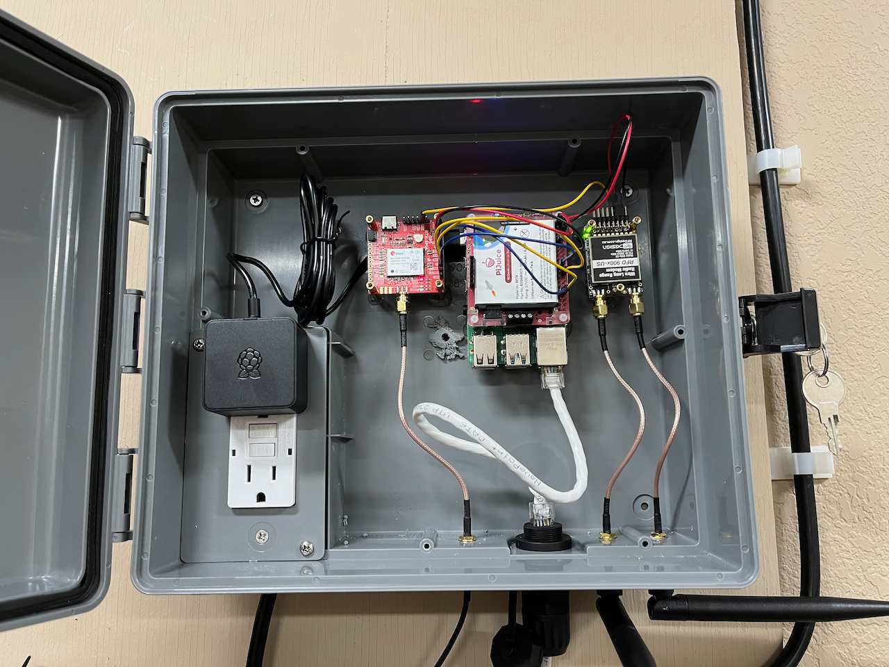
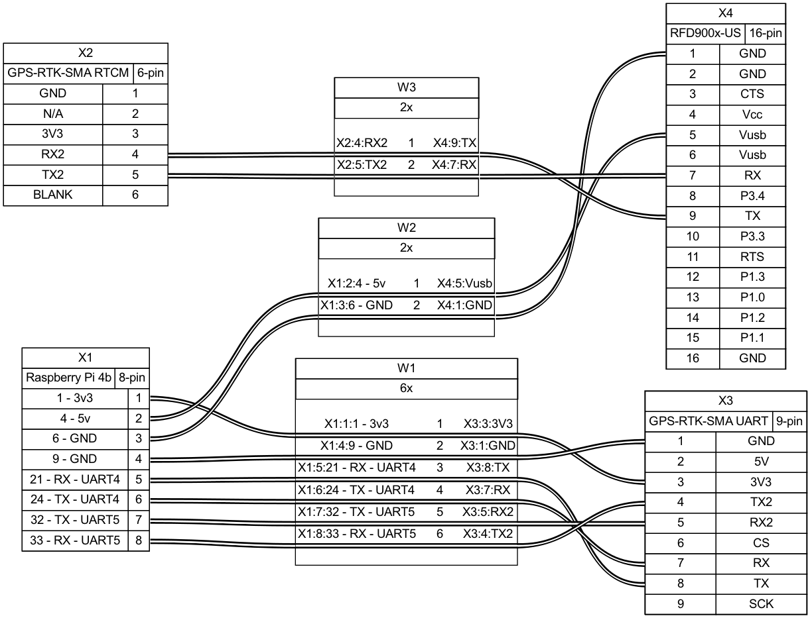
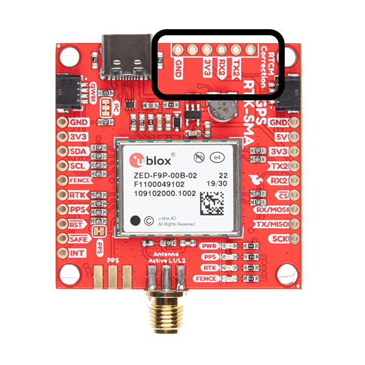
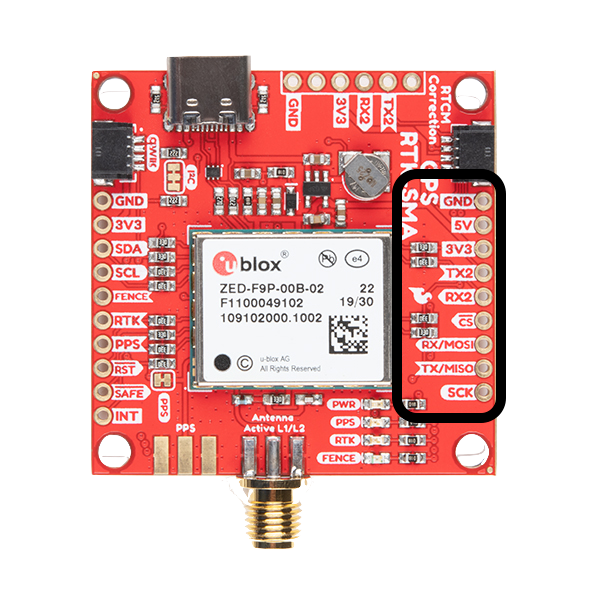

# RTCM-Pi
GNSS Base Station based on Raspberry Pi 4B **NO LONGER MAINTAINED**

# Background
This project is intented to provide a design for creating a GNSS Reference Station using affordable and accessible hardware while maintaining high standards for functionality and reliability. The equipment used for this project is as follows:
1. [Raspberry Pi 4B](https://rpilocator.com/?country=US&cat=PI4)
2. [SparkFun GPS-RTK-SMA (u-blox ZED-F9P)](https://www.sparkfun.com/products/16481)
3. [RFD900x-US Telemetry Modem](https://irlock.com/collections/telemetry/products/rfd900x-us-telemetry-modem-fcc-approved)
4. [PiJuice HAT](https://www.sparkfun.com/products/14803)
5. [GNSS Multi-Band L1/L2 Antenna TOP106](https://www.sparkfun.com/products/17751)

Please note that other hardware/accessories are required for this project:
1. Soldering Iron [example](https://www.sparkfun.com/products/14228)
2. Break Away Headers [example](https://www.sparkfun.com/products/116)
3. Jumper Wires F/F [example](https://www.sparkfun.com/products/12796)
4. SMA Male to TNC Male [example](https://www.sparkfun.com/products/17833)
5. SMA Male to SMA Female [example](https://www.sparkfun.com/products/17495)
6. Outdoor Junction Box [example](https://www.amazon.com/dp/B000VYGMF2)
7. MicroSD Card [example](https://www.amazon.com/gp/product/B09W9XYQCQ)

# Design
RTCM-Pi is connected as follows:

Where GPS-RTK-SMA RTCM refers to the RTCM Correction headers

And where GPS-RTK-SMA UART refers to the standard UART headers on the right side of the board

# Initial Configuration

## ZED-F9P
You will need a Windows computer running U-Center [Getting Started Tutorial](https://learn.sparkfun.com/tutorials/getting-started-with-u-center-for-u-blox?_ga=2.72617818.894981287.1656259362-1501454225.1648055374).

Download the latest ZED-F9P firmware file from either the u-Blox website or [this GitHub repo](https://github.com/sparkfun/SparkFun_RTK_Firmware/tree/main/Binaries/ZED%20Firmware/ZED-F9P).

Update the F9P to the latest firmware following [this tutorial](https://learn.sparkfun.com/tutorials/how-to-upgrade-firmware-of-a-u-blox-gnss-receiver/all).

Open a Configuration View Window and navigate to the MSG tab

* Set RXM-RAWX messages to transmit via UART1 every 1 second. (Be sure to send the configuration message after each setting that you change)
* RXM-SFRBX to UART1, 1
* RTCM3.3 1005 UART2, 1
* RTCM3.3 1074 UART2, 1
* RTCM3.3 1084 UART2, 1
* RTCM3.3 1094 UART2, 1
* RTCM3.3 1124 UART2, 1
* RTCM3.3 1230 UART2, 5

Go to the PRT tab in the Configuration View Window
* UART1
    * Protocol in: none
    * Protocol out: UBX + NMEA + RTCM3
    * Baudrate 57600
* UART2
    * Protocol in: RTCM3
    * Protocol out: RTCM3
    * Baudrate 57600

Go to the CFG tab in the Configuration View Window
* Save current configuration to ALL

## Raspberry Pi 4
Install Ubuntu Server 22.04 64bit onto the MicroSD card via Raspberry Pi Imager

Edit config.text and add the following lines after ‘enable_uart=1’:
dtoverlay=uart4
dtoverlay=uart5

NOTE: This will allow you to use:
* ttyAMA2 to read RTCM data
* ttyAMA1 to read RAWX data

Insert the MicroSD card into the Pi and power it on

SSH into device and change the password. (Temporary username and password are 'ubuntu')
SSH into it again

Update hostname via:
`hostnamectl set-hostname [desired_hostname]`
verify the name change was effective with `hostnamectl`

Reboot via:
`sudo reboot now`

SSH in again

`sudo apt update`
`sudo apt upgrade`

`git clone https://github.com/ALA-Engineering/RTKLIB.git`

`sudo apt install build-essential -y`

`cd RTKLIB/app/consapp/str2str/gcc/ && make && cd`

`cd RTKLIB/app/consapp/convbin/gcc/ && make && cd`

`sudo apt install python3-pip -y`

`pip3 install selenium`

`sudo apt install firefox`

`wget https://github.com/mozilla/geckodriver/releases/download/v0.31.0/geckodriver-v0.31.0-linux64.tar.gz`

`tar -xvzf geckodriver*`

`chmod +x geckodriver`

`sudo mv geckodriver /usr/local/bin/`

`rm geckodriver-v*`

`sudo apt install xvfb -y`

`pip3 install pyvirtualdisplay`

# Initial Survey
Run an initial 24 hour survey using the following command:
`timeout 24h ./RTKLIB/app/consapp/str2str/gcc/str2str -in serial://ttyAMA1:57600:8:n:1:off -out [desired_filename].ubx`

After the survey completes, convert it to .obs file using:
`./RTKLIB/app/consapp/convbin/gcc/convbin -od -os -oi -ot -ti 30 [desired_filename].ubx`

Wait at least half an hour, but 2 weeks works best. (You can always finish setup with a 30 minute wait and update later with another PPP solution)

Process .obs file with PPP solution of your choice. Below are two headless automations using Selenium that can automatically upload to the PPP provider. Please note that you will need to edit the .py file to include your information like email and password.
* [OPUS-Selenium](https://github.com/jacobjhansen/OPUS-Selenium)
* [CSRS-Selenium](https://github.com/jacobjhansen/CSRS-Selenium)

# Final Configuration

## ZED-F9P
Using U-Center, open a Configuration View Window.

Navigate to the TMODE3 tab.
Set Mode to '2 - Fixed Mode'
Enter the ECEF coordinates you recieved from your chosen PPP provider and send the configuration message

Go to the CFG tab in the Configuration View Window
* Save current configuration to ALL

## Raspberry Pi 4
add the following to crontab using `crontab -e`:
@reboot ./RTKLIB/app/consapp/str2str/gcc/str2str -in serial://ttyAMA2:57600:8:n:1:off -out ntrips://:[base_station_password]@[ntrip_caster_ip]:[ntrip_caster_port]/[base_station_name]

Now your Raspberry Pi will automatically begin sending RTCM data to your NTRIP Caster upon bootup.

# Additional Comments
For a ROS2 Rover implementation using a ZED-F9R, check out this [GitHub Repo](https://github.com/ALA-Engineering/ublox_f9r)
